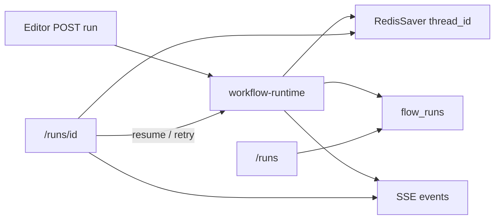

# Workflow 运行监控模块拆解计划

本计划对应 PLAN.md **Phase 3**。编辑器与编译器已具备（`[lib/workflow-dsl/compile.ts](lib/workflow-dsl/compile.ts)` 已实现 `interrupt`；`[flow_runs](supabase/migrations/20260907134000_evolve_flows.sql)` / `[FlowRunRow](lib/workflow-dsl/tables.ts)` 已落库）。**缺口是 Runner（invoke/stream/resume）与监控 UI**。监控页本身不编译草稿，只跑 `flow_versions` 钉死的 DSL。

## 现状与约束

- API 前缀已是单数 `[/api/workflow/compile](app/api/workflow/compile/route.ts)`、`[/api/workflow/publish](app/api/workflow/publish/route.ts)`，运行接口沿用 `/api/workflow/...`，页面路由按需求用 `/runs`、`/runs/[id]`。
- Chat 已有 SSE 协议 `[lib/agent-runtime/sse.ts](lib/agent-runtime/sse.ts)` + Redis `thread_id` checkpoint；工作流 **thread_id =** `flow_runs.thread_id`，隔离Checkpointer，工作流与 chat不能混用。工作流引擎必须使用基于postgres的持久化checkpointer。使用@langchain/langgraph- checkpoint-postgres，把每一次节点执行的二进制状态永久写进Postgres的checkpoints表中
- 列表筛选文案映射库状态：运行中=`running`（含短暂 `pending`）、成功=`completed`、失败=`failed`、挂起=`interrupted`。`cancelled` 入库但不进四个主筛选项。
- 业务展示层 和 底层引擎层 做ID隔离：前端路由URL 的 `[id]` 用 `**flow_runs.id**`（UUID）；`thread_id` 只作为 LangGraph configurable，不进路径（避免暴露 Postgres key、也方便列表 join）。



---

## 1. 目录与组件划分

按仓库约定：页面在 `app/(dashboard)/runs/`，组件在该模块 `components/`，纯函数在该模块 `lib/`；可 invoke 的图与流协议放 `lib/workflow-runtime/`（与 `lib/agent-runtime/` 并列，PLAN §4），不要塞进编辑器页。

```
app/(dashboard)/runs/
  page.tsx                      # 列表：筛选 + 表格
  [id]/page.tsx                 # 控制台壳：左右分栏
  components/
    run-status-badge.tsx
    run-list-filters.tsx
    run-list-table.tsx
    run-console-layout.tsx      # 左右分栏骨架
    run-event-timeline.tsx      # token / tool_start / tool_end / node_*
    run-interrupt-form.tsx      # 按 interrupt_payload.form 动态表单
    run-canvas.tsx              # 只读 React Flow
    run-node-state-panel.tsx    # 点击节点后的历史 State
  lib/
    status.ts                   # UI 四态 <-> FlowRunStatus
    event-reducer.ts            # SSE 事件 -> 时间线 / 当前节点（纯函数，Vitest）
    highlight.ts                # status + events -> current/done/failed 集合
    resume-payload.ts           # 按 formFields 校验 resume 值
  store/
    run-console-store.ts        # Zustand：仅详情页生命周期
lib/workflow-runtime/
  sse.ts                        # WorkflowSseEvent + encode（可复用 chat 的 token/tool）
  runner.ts                     # compile 已发布 DSL + stream / Command resume / retry
  persist.ts                    # 写 flow_runs.status / interrupt_payload / output / error
app/api/workflow/
  run/route.ts                  # POST 启动（编辑器入口也走这里）
  runs/route.ts                 # GET 列表
  runs/[id]/route.ts            # GET 快照
  runs/[id]/events/route.ts     # GET SSE
  runs/[id]/resume/route.ts     # POST
  runs/[id]/retry/route.ts      # POST 节点重试
  runs/[id]/nodes/[nodeId]/state/route.ts  # GET 节点历史 state
```

侧栏在 `[app/(dashboard)/layout.tsx](<app/(dashboard)`/layout.tsx>) 增加「运行监控」→ `/runs`。编辑器顶栏增加「运行」：保存并已发布后 `POST /api/workflow/run`，成功则 `router.push(/runs/{id})`（监控模块的数据入口，否则列表永远空）。

### 列表页 `/runs`

- 顶栏：状态四选一 + 「全部」；可选 `flowId` 查询（从工作流页跳入时带上）。
- 表格列：工作流名、版本、`thread_id` 截断、状态徽章、创建/更新时间、错误摘要。
- 行点击进 `/runs/[id]`。`interrupted` 行额外标「待干预」。
- 数据：`GET /api/workflow/runs`；进行中行可轻量轮询列表（5–10s），详情页才开 SSE。

### 详情页 `/runs/[id]` 左右分栏

**左：交互与日志（可滚动，不碰画布）**

- 运行头：flow 名、version、status、thread_id、取消（可选延后）。
- `RunEventTimeline`：按 reducer 累积的 `node_start` / token / `tool_start|end` / `node_end` / `error` / `interrupt`。
- `RunInterruptForm`：仅 `status=interrupted` 时渲染。字段来自 `interrupt_payload.form`（即 DSL `formFields`：text / enum / boolean）。提交走 resume，不直接打 Postgres。

**右：只读画布**

- 复用 `[workflowNodeTypes](<app/(dashboard)`/workflows/components/workflow-nodes.tsx>) 与版本快照 DSL（`flow_versions.dsl`），**禁用**拖拽、连线、删除、palette。
- 高亮：执行中（脉冲边框）、已完成、失败、挂起（与 interrupt 节点一致）。
- 点击节点：拉该节点最近一次 checkpoint 快照，右侧画布下方或浮层展示 `RunNodeStatePanel`（`vars` / `lastAgentText` / messages 摘要）。只读，避免和编辑器 Drawer 抢交互。

编辑器的 `NodeIssuesContext` 不要复用；监控用 `RunHighlightContext`（见下），避免把 Zustand 的 token 更新灌进每个节点卡。

---

## 2. 状态管理层：Zustand + 窄 Context（不要全局 Context 扛 SSE）

编辑器今天是 page 内 `useState`，没有 Zustand。监控详情是 **高频流 + 跨左右栏 + React Flow 很重**，推荐：

| 层                                                     | 用途                                                                                                                      | 不该放什么                |
| ------------------------------------------------------ | ------------------------------------------------------------------------------------------------------------------------- | ------------------------- |
| **Zustand `useRunConsoleStore`**（仅挂在 `[id]/page`） | `run` 行、`dsl`、`events[]`、`interrupt`、`connection`（idle/streaming/reconnecting）、`selectedNodeId`、`nodeStateCache` | 列表筛选、编辑器 document |
| `**RunHighlightContext**`                              | 由 store 派生的 `{ currentNodeId, doneNodeIds, failedNodeId, interruptedNodeId }`，只喂给只读节点卡                       | token 字符串              |
| **URL `?node=`（可选）**                               | 刷新后仍能打开某个节点 state 面板                                                                                         | 运行时事件                |

**为何不用单一 React Context 装全部 run state：** Context 任何 `events` 追加都会让左右栏 + React Flow 一起重渲染。Zustand 选择器让时间线订阅 `events`，画布只订阅高亮集合（`shallow`）。

**列表页不要进 Zustand。** 筛选用 `useSearchParams`（`status`、`flowId`），与详情 store 解耦，避免切路由残留上一 run 的 token。

Store 核心形状（示意）：

- `hydrate(snapshot)`：GET 快照写入 run/dsl/interrupt，并用已持久化的事件（若有）重建时间线。
- `applyEvent(event)`：调用纯函数 `reduceRunEvents`（Vitest 对象）。
- `setConnection` / `selectNode` / `putNodeState`。

派生高亮 **禁止**手写散落在组件里，统一 `[runs/lib/highlight.ts](<app/(dashboard)`/runs/lib/highlight.ts>)：`interrupted` → payload.nodeId；`running` → 最近 `node_start` 且无 `node_end`；`failed` → 最近出错节点。

---

## 3. 运行时与传输：SSE 为主、快照轮询兜底

### 3.1 Runner（服务端）

`[compileWorkflow](lib/workflow-dsl/compile.ts)` 已要求 HITL 必须带 checkpointer。Runner 步骤：

1. 读 `flow_runs` + 对应 `flow_versions.dsl`（禁止用草稿 `flows.dsl`）。
2. `compileWorkflow(dsl, { checkpointer, userId })`。
3. `graph.stream(input | Command, { configurable: { thread_id }, streamMode: ['updates'] })`，并并行 `graph.streamEvents` 映射 token/tool（对齐 chat 的 `mapStreamEvent`）。
4. 每个节点 `updates` 记 `node_start`/`node_end`；`GraphInterrupt` → `status=interrupted`，`interrupt_payload` 写入 interrupt 对象（已有 `{ nodeId, kind, form, snapshot }`）。
5. 正常结束 → `completed` + `output`（vars / lastAgentText 摘要）；异常 → `failed` + `error`。
6. 进程可退出：挂起只靠 Redis checkpoint + 行状态；resume 用同一 `thread_id`。

**事件持久化（刷新不丢时间线）：** 仅 Redis checkpoint 不够还原工具过程。使用独立子表 `flow_run_events`：只存粗粒度 `node_start`、`tool_start`/`tool_end`、合并后的 `node_end` 文本。细粒度 `token` **不落库**，只在当次 SSE 内存透传，并由 Redis 缓冲供 `Last-Event-ID` 断点补发。列表不读 events。详情 hydrate 用子表重建工具/节点时间线；token 动画只在有缓冲或仍在流式时衔接。

### 3.2 SSE 事件（独立于 ChatSseEvent，避免污染 chat）

```ts
type WorkflowSseEvent =
  | { type: "run_status"; status: FlowRunStatus; currentNodeId?: string }
  | { type: "node_start"; nodeId: string }
  | { type: "node_end"; nodeId: string }
  | { type: "token"; nodeId?: string; content: string }
  | {
      type: "tool_start";
      nodeId?: string;
      name: string;
      input: unknown;
      runId?: string;
    }
  | {
      type: "tool_end";
      nodeId?: string;
      name: string;
      output: unknown;
      runId?: string;
    }
  | { type: "interrupt"; payload: FlowRunInterruptPayload }
  | { type: "error"; message: string; nodeId?: string }
  | { type: "done" };
```

连接策略：

- 打开详情：先 `GET` 快照（含 dsl、status、interrupt、events）。
- 若 `pending|running`：再 `GET .../events` SSE；`/api/workflow/runs/[id]/events` 接口必须支持 `Last-Event-ID`（标准 SSE 协议）。前端重连时带上最后收到的事件 ID，后端 Redis 从断点处把积压的 Token 补发过去，保证前端动画的完美衔接。
- 若 `interrupted|completed|failed`：不开长连接；用户 resume/retry 成功后再切回 SSE。
- 列表页不对单条开 SSE。

---

## 4. API 契约

统一 JSON：`{ ok: true, ... }` / `{ ok: false, errors: [{ message, path, nodeId? }] }`。`user_id` 继续 `NEXT_PUBLIC_MOCK_USER_ID`；写库走 `createSupabaseAdmin()`（与 publish 一致）。validate/run/resume **禁止**浏览器直连 Redis。

### `POST /api/workflow/run`

启动一次执行（编辑器「运行」）。

- Body: `{ flowId: string, input?: { messages?: unknown[]; vars?: Record<string, unknown> } }`
- 行为：确认 published 版本存在 → insert `flow_runs`（`thread_id` 新 UUID，`status=pending`）→ 后台/同请求开始 stream（同请求 SSE 会卡住「运行」按钮，**推荐 insert 后立刻 200 返回 `{ run }`，由详情页连 events**）。
- 201/200: `{ ok: true, run: FlowRunRow }`
- 422: 未发布 / 编译失败

### `GET /api/workflow/runs`

- Query: `status?=running|completed|failed|interrupted`（服务端映射 pending→running 组）、`flowId?`、`limit`/`cursor`
- `{ ok: true, items: Array<FlowRunRow & { flowName: string }> }`

### `GET /api/workflow/runs/[id]`

详情 hydrate。

- `{ ok: true, run, dsl: WorkflowDocument, events: WorkflowSseEvent[] }`
- 404 非本人/不存在

### `GET /api/workflow/runs/[id]/events`

`text/event-stream`，headers 与 chat 相同（`Cache-Control: no-cache`、`X-Accel-Buffering: no`）。若 run 已是终态，先回放 persisted events 再 `done` 并关流。

### `POST /api/workflow/runs/[id]/resume`

恢复 HITL。

- Body: `{ resume: Record<string, unknown> }`（键对齐 `formFields[].name`）
- 前置：`status===interrupted`，否则 409
- 服务端：`graph.stream(new Command({ resume }), { thread_id })`，把行打回 `running`，清 `interrupt_payload`
- 200: `{ ok: true, run }`；客户端再挂 SSE
- 校验失败 422（缺 required、enum 不在 options）

### `POST /api/workflow/runs/[id]/retry`

节点级重试（失败或挂起节点）。

- Body: `{ nodeId: string }`
- 允许：`failed` 且 `nodeId` 为出错节点；或 `interrupted` 且 `nodeId` 为当前 interrupt 节点（「重填」走 resume，retry 表示丢弃本次 interrupt 结果、从该节点再执行一次）
- 实现要点：在执行重试前，必须先利用 Checkpoint 的“时间旅行（Time Travel）”**能力。调用** `graph.updateState`**，将状态精确回滚到目标节点执行**前的那一个快照版本（剥离掉失败产生的新 messages），然后再触发重新执行。**不要** new `thread_id`（否则丢失上游 vars）。若 checkpoint 无法定位该节点，返回 409。
- 成功后 `status=running`，详情重连 SSE。

### `GET /api/workflow/runs/[id]/nodes/[nodeId]/state`

点击画布节点。

- 从 Redis checkpoint 历史中找 **该节点最后一次 `updates` 后的 `channel_values`**（可复用 `[checkpoint-history.ts](lib/agent-runtime/checkpoint-history.ts)` 的 list 思路，但返回 workflow state 而非 chat messages）。
- `{ ok: true, nodeId, state: { vars, lastAgentText, messagesPreview }, checkpointTs? }`
- 节点从未执行：200 + `state: null`（面板显示「尚未执行」），不要 404。

`GET /api/workflow/runs/[id]` 已含 dsl，画布不必再打 versions 表。

---

## 5. 纯函数与测试（Vitest）

只测转换，不测 React：

- `mapListStatus`：四态筛选含 pending、漏掉 cancelled
- `reduceRunEvents`：空数组、乱序 `tool_end`、interrupt 后仍收到 token
- `deriveHighlight`：无 node_start、连续两节点、failed+error.nodeId 缺失
- `parseResumePayload`：缺必填、非法 enum、非 object resume
- Runner 侧若抽出 `interruptToRowPatch` / `commandForRetry`：非法 nodeId、非 interrupted 调用 resume

---

## 6. 实施顺序

1. `lib/workflow-runtime`：stream → 写 `flow_runs` + SSE 编码；human_review 端到端 interrupt。
2. `flow_run_events` 子表：粗粒度事件落库；token 不入库。
3. `POST run` + `GET runs` + 列表页 + 侧栏 + 编辑器「运行」。
4. 详情壳 + Zustand hydrate + 只读画布高亮（可先用轮询 `GET [id]` 打通高亮）。
5. `GET events` SSE + `Last-Event-ID` 断点补发；时间线。
6. `RunInterruptForm` + `POST resume`。
7. 节点 state GET + 点击面板。
8. `POST retry`（checkpoint 时间旅行）+ 失败态画布入口。
9. Vitest 纯函数边界用例。

刻意延后：取消 run、`stopAfter` 单步、token 级永久落库、多人实时协同。
